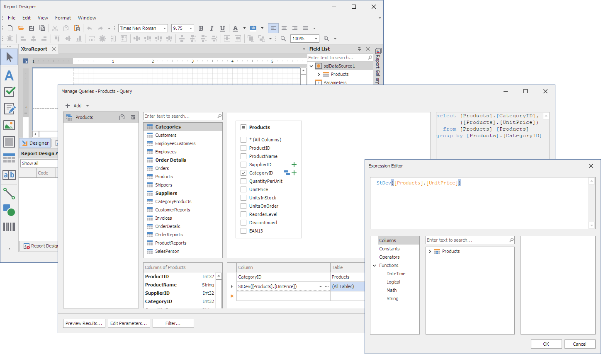

<!-- default badges list -->

<!-- default badges end -->
# Reporting for WinForms - Implement a Custom Function for Use in a Query Expression

This example shows a custom function that evaluates the standard deviation (similar to the “stdev” function available in Microsoft SQL) for use in a SELECT query.

## Implementation

### Interfaces

A custom function implements the following interfaces: 

- [ICustomFunctionOperator](http://docs.devexpress.devx/CoreLibraries/DevExpress.Data.Filtering.ICustomFunctionOperator)
- [ICustomFunctionOperatorBrowsable](http://docs.devexpress.devx/CoreLibraries/DevExpress.Data.Filtering.ICustomFunctionOperatorBrowsable)
- [ICustomFunctionOperatorFormattable](http://docs.devexpress.devx/CoreLibraries/DevExpress.Data.Filtering.ICustomFunctionOperatorFormattable)

### Registration

The static [CriteriaOperator.RegisterCustomFunction](http://docs.devexpress.devx/CoreLibraries/DevExpress.Data.Filtering.CriteriaOperator.RegisterCustomFunction(DevExpress.Data.Filtering.ICustomFunctionOperator)) method registers a custom function in this example.

For convenience, the custom function implements a static `Register` method that registers the function. Call this method  at application startup. 

## Use

After registration, you can use the function as part of an SQL statement. The custom function appears in the Query Editor function list among other functions.

See also: Expression Editor - How to implement a custom New Line and Format functions.

## Files to Review

* [Form1.cs](./CS/SelectQueryWindowsFormsApplication/Form1.cs) (VB: [Form1.vb](./VB/SelectQueryWindowsFormsApplication/Form1.vb))
* [StDevOperator.cs](./CS/SelectQueryWindowsFormsApplication/StDevOperator.cs) (VB: [StDevOperator.vb](./VB/SelectQueryWindowsFormsApplication/StDevOperator.vb))

## Documentation 

- [Custom Functions](https://docs.devexpress.com/XtraReports/403888/detailed-guide-to-devexpress-reporting/use-expressions/custom-functions)
- [Custom Aggregate Functions](https://docs.devexpress.com/XtraReports/403889/detailed-guide-to-devexpress-reporting/use-expressions/custom-aggregate-functions)
- [Functions in Expressions](https://docs.devexpress.com/XtraReports/403363/detailed-guide-to-devexpress-reporting/use-expressions/functions-in-expressions)

## More Examples

- [How to Implement Custom Functions in the Expression Editor](https://github.com/DevExpress-Examples/reporting-custom-functions-in-the-expression-editor)
